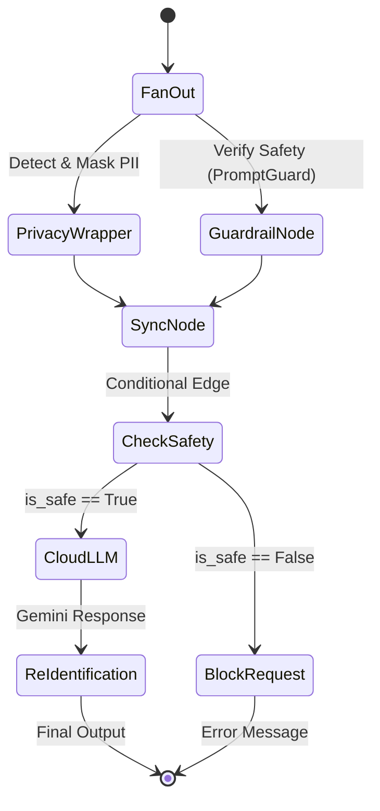

# LangGraph State Machines

This document describes the decision flows within the Privacy Gateway system using Mermaid state diagrams.

## Main Privacy Flow

The primary orchestration logic is defined in `src/app/infrastructure/agents/privacy_graph.py`. It uses a parallel execution pattern (Fan-out/Fan-in) to ensure privacy protection and security guardrails are processed efficiently.

### Node Descriptions

| Node | Responsibility | Use Case Involved |
| :--- | :--- | :--- |
| **PrivacyWrapper** | Orchestrates PII detection, labeling, and masking for both query and context. | `DetectionUseCase`, `LabelingUseCase`, `MaskingUseCase` |
| **GuardrailNode** | Checks the input query for malicious intent or disallowed topics. | `GuardrailUseCase` |
| **SyncNode** | Waits for both parallel processes to complete and merges their states. | N/A |
| **CloudLLM** | Sends the masked query and context to a high-performance cloud model. | `CloudProcessingUseCase` |
| **BlockRequest** | Returns a standardized error message if the input is deemed unsafe. | N/A |
| **ReIdentification** | Replaces PII tokens in the LLM response with original values from the vault. | N/A (Internal logic) |

### State Definition

The graph operates on the `GraphState` entity (defined in `src/app/domain/entities.py`), which maintains:
- Raw inputs (`file_context`, `user_query`).
- Detected PII (`raw_pii_strings`, `labeled_pii_entities`).
- Masked versions (`masked_query`, `masked_context`).
- Re-identification mapping (`vault`).
- Security flags (`is_safe`).
- Model responses (`cloud_response`, `final_output`).
- Configuration (`detection_mode`, `enable_guardrail`, `guardrail_threshold`).
