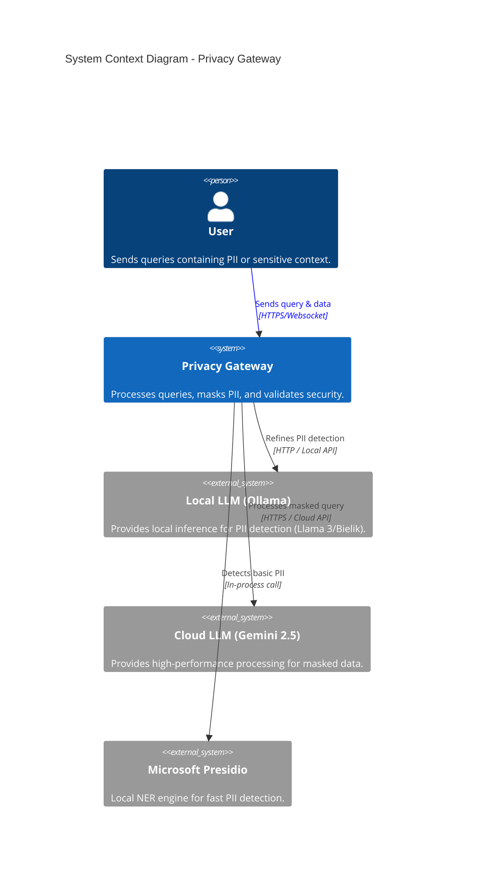
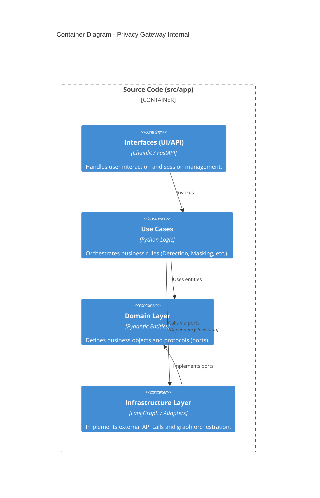

# System Context & Containers

This document describes the high-level architecture of the Privacy Gateway and its integration with external systems.

## High-Level System Context (C4)

Privacy Gateway acts as a secure intermediary between users and potentially unsafe/non-private Large Language Models.

## Internal Containers (Clean Architecture)

The system is organized into layers to ensure separation of concerns and maintainability.

### Key Components

1. **Interfaces**: Currently implemented using **Chainlit** for the web UI and a CLI for testing.
2. **Use Cases**: Each business action (e.g., `DetectionUseCase`) is isolated and testable.
3. **Domain**: Contains the "Source of Truth" for data models and the definition of what a service (like an LLM) must do.
4. **Infrastructure**: Contains the "dirty" details – how to talk to Gemini, how to run a LangGraph, how to configure Presidio.
